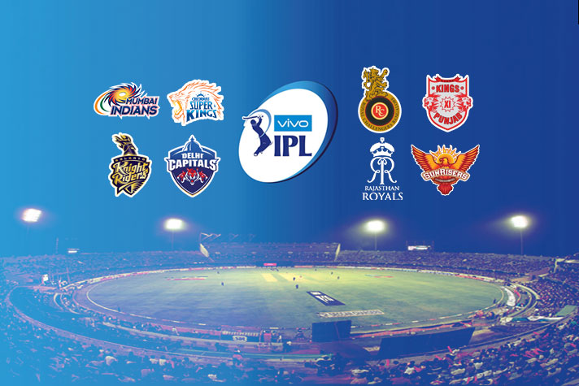
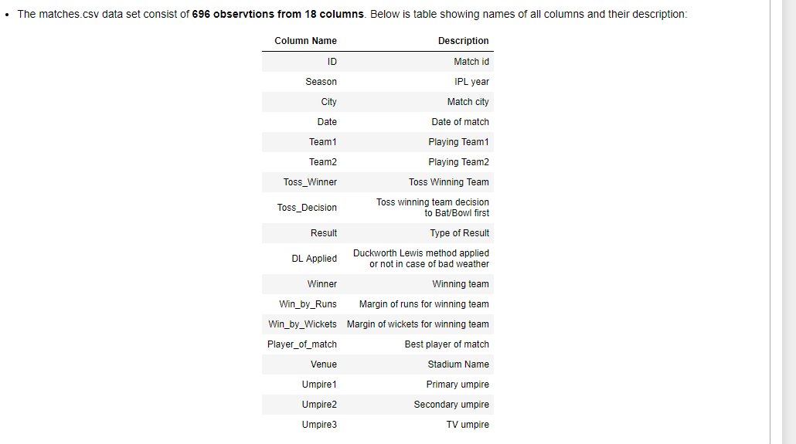
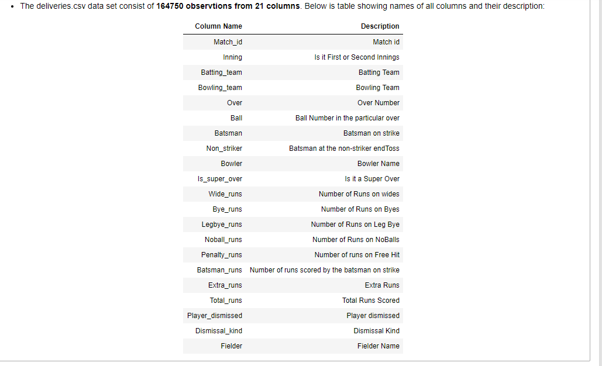

### About IPL in brief

The Indian Premier League (IPL) is a professional Twenty20 cricket league in India contested during March or April and May of every year by eight teams representing eight different cities in India. The league was founded by the Board of Control for Cricket in India (BCCI) in 2008, and is regarded as the brainchild of Lalit Modi, the founder and former commissioner of the league. IPL has an exclusive window in ICC Future Tours Programme. 

The IPL is the most-attended cricket league in the world and in 2014 ranked sixth by average attendance among all sports leagues.In 2010, the IPL became the first sporting event in the world to be broadcast live on YouTube.The brand value of IPL in 2018 was US$6.3 billion, according to Duff & Phelps.[8] According to BCCI, the 2015 IPL season contributed ₹12,543.5 billion to the GDP of the Indian economy.

There have been eleven seasons of the IPL tournament. The current IPL title holders are the Chennai Super Kings, who won the 2018 season.

__Tournament format__

Currently, with eight teams, each team plays each other twice in a home-and-away round-robin format in the league phase. At the conclusion of the league stage, the top four teams will qualify for the playoffs. The top two teams from the league phase will play against each other in the first Qualifying match, with the winner going straight to the IPL final and the loser getting another chance to qualify for the IPL final by playing the second Qualifying match. Meanwhile, the third and fourth place teams from league phase play against each other in an eliminator match and the winner from that match will play the loser from the first Qualifying match. The winner of the second Qualifying match will move onto the final to play the winner of the first Qualifying match in the IPL Final match, where the winner will be crowned the Indian Premier League champions

## DATA

## PROJECT ANALYSIS
- Please refer the jupyter notebook /EDA_IPL_Matches_n_Deliveries.ppt on analysis part

## CONCLUSIONS
- This notebook helps us understanding how Exploratory Data Analysis carried out using different python packages i.e pandas,pandas_profiling, seaborn, matplotlib etc.
- Pandas helps us in __maipulating__ the data whereas __matplotlib and seaborn__ to visualise the data and get better insights.
- We also make use of __pandas profiling__ feature to generate an html report containing all the information of the various features present in the dataset.
- We have also seen how __pre proceesing__ helps in dealing with data ambiguities.
- __Chennai and Mumbai__ are the top IPL teams winning 3 trophies each so far.
- We have seen the impact of columns like __Toss_decision, Toss_winner__ on winning team,also we added _type__ column which gives us Top IPL winning teams.
- We have also seen __Teams having good fortune with coin, Top match winners, Best chasing and defending teams as well as venues and top IPL winning teams__.
- We have also done some pre-processing to help us understand __Aggregates__ of Batsmens and Bowlers

- This analysis helped us in __getting meaningful insights__ from excel data.

- =============================================================================
* __Actionable Insights :__  
- __Eden Gardens and M Chinnaswamy Stadium__ are best Chasing Venues, so toss winner should choose to bowl first that will give an added advantage to the toss winning team.
- __Wankhede Stadium and Feroz Shah Kotla__ are best defending Venues, so toss winner should choose to bat first that will give an added advantage to the toss winning team.
- __Kolkata__ should host less ipl matches as there is a probability of match getting washed out or D/L applied
- __Royal Challengers Bangalore__ have played 2nd most number of matches but haven't won any of the trophies, their team management should focus on their players mental strength in high current games.
- __Mumbai, Chennai and Kolkata__ have collectively won 8 season out of 11 seasons happened so far, opposite teams should prepare strong strategy while playing against these teams.
- __ Batting Second__ has more probability of winning the match.
- __Winning the toss__ give us 50% chance to win the match, make sure to give the right call during the toss. In Finals, its an added advantage to win the toss..its almost winning the match itself
- __MI__ is the best defending team, so make sure to bat while achieving the target given by MI 
- __KKR__ is the best chasing team, make sure to score as many runs as possible while playing with them 
- __MI and RCB__ score a lot of runs in the last 5 overs, make sure to bowl in right areas when playing against them
- __Chris Gayle, AB Devilliers__ are top match winners so team owners should focus on buying these players in upcoming seasons or opposite team should make good strategies to get them out soon.
- __CSK__ plays very well either in 1st or 2nd innings. Plan appropriately when playing against them.
- __RCB and CSK__ can take the game away as they have chances of scoring 200+ in a match. Have strategy planned when playing against them 
- __Kohli__ make the score board ticking with 1's,2's. , The opponent team can get a chance for getting him runout.
- Crowd should wear helmets and cheer girls should have stamina to dance, when __Chris Gayle__ is batting,  as he is dominant in hitting 6's and 4's.

- __More info can still be extracted by looking at the data generated in this notebook on IPL__

[Jupyter Notebook](./EDA_IPL_Matches_n_Deliveries.ipynb)
