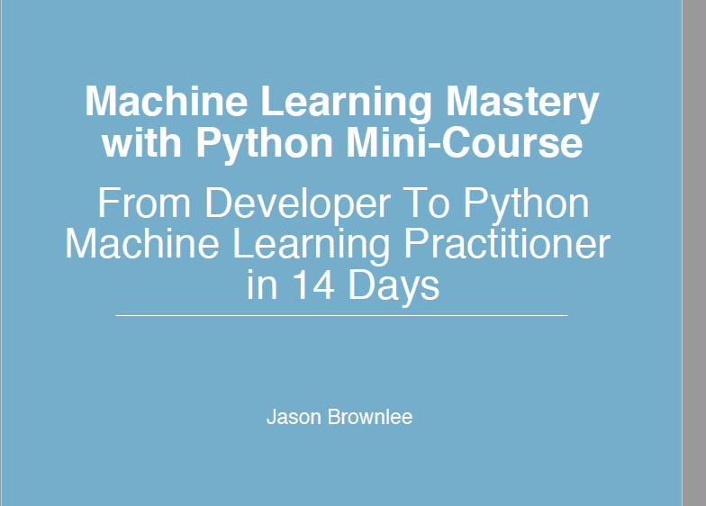

### FROM DEVELOPER TO PYTHON MACHINE LEARNING PRACTITIONER in 14 Days by Jason Brownlee

In this mini-course you will discover how you can get started, build accurate models and
confidently complete predictive modeling machine learning projects using Python in 14 days.

## ANALYSIS
- Please refer the PDF file and jupyter notebook 

[Jupyter Notebook](./Jason_ML_MiniCourse.ipynb)
