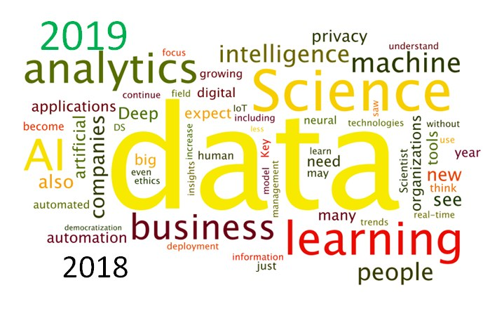

# My_HandsON_Work
This repository contains my Hands_On Projects with respect to DataAnalysis/MachineLearning

# About Data Science

## INTRODUCTION
Data science is a multi-disciplinary field that uses scientific methods, processes, algorithms and systems to extract knowledge and insights from structured and unstructured data
