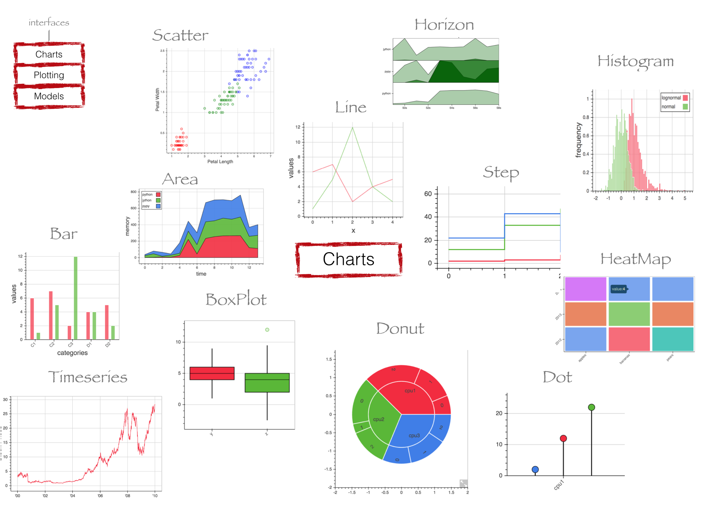

# Type of Plots in Data Science

## INTRODUCTION
I have considered few datasets and did some analysis using different plots available in Data Analysis.
You can refer the note book attached to understand the most used plots in data-analysis

[Jupyter Notebook](./Types_of_Plots_in_DataScience.ipynb)
